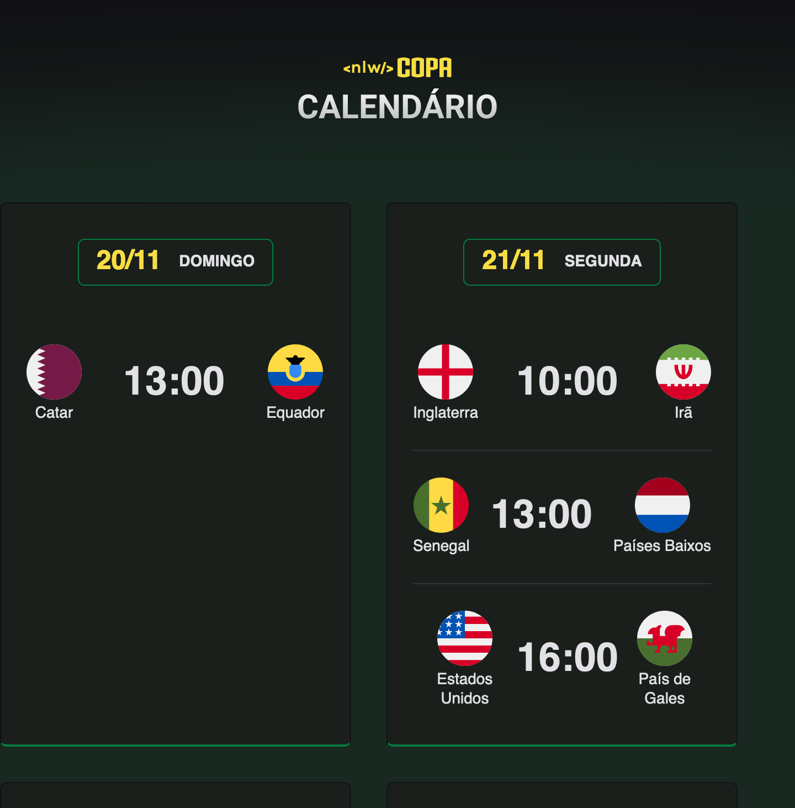

<h1 align="center"> NLW #10 Copa </h1>

Evento exclusivo e gratuito, promovido pela Rocketseat para ensino de tenologias WEB.

    <a href="#-tecnologias">Tecnologias</a>&nbsp;&nbsp;&nbsp;|&nbsp;&nbsp;&nbsp;
    <a href="#-projeto">Projeto</a>&nbsp;&nbsp;&nbsp;|&nbsp;&nbsp;&nbsp; 
    <a href="#-layout">Layout</a>&nbsp;&nbsp;&nbsp;|&nbsp;&nbsp;&nbsp;
    <a href="#memo-licenca">Licença</a>

 

    

 

    

## 🚀 Tecnologicas
Esse projeto foi desenvolvido com as seguintes tecnologias:

    
    
    
    

## 💻 Projeto
O *NLW - Copa* é um projeto que mostra os jogos da fase de grupos da Copa do Mundo 2022.

## 🔖 Layout
Você pode conferir o layout do projeto no [NESSE LINK](https://www.figma.com/community/file/1169028052212317700). É necessário ter conta no [FIGMA](https://www.figma.com/) para acessá-lo.

## :memo: Licença
Esse projeto está sob a licença MIT.

--
O NLW - Copa é um projeto criado pela [RocketSeat](http://rocketseat.com.br) onde os participantes contruiram o calendário da Copa do Mundo através de cinco aulas gratuitas 🆓🚀❤️

